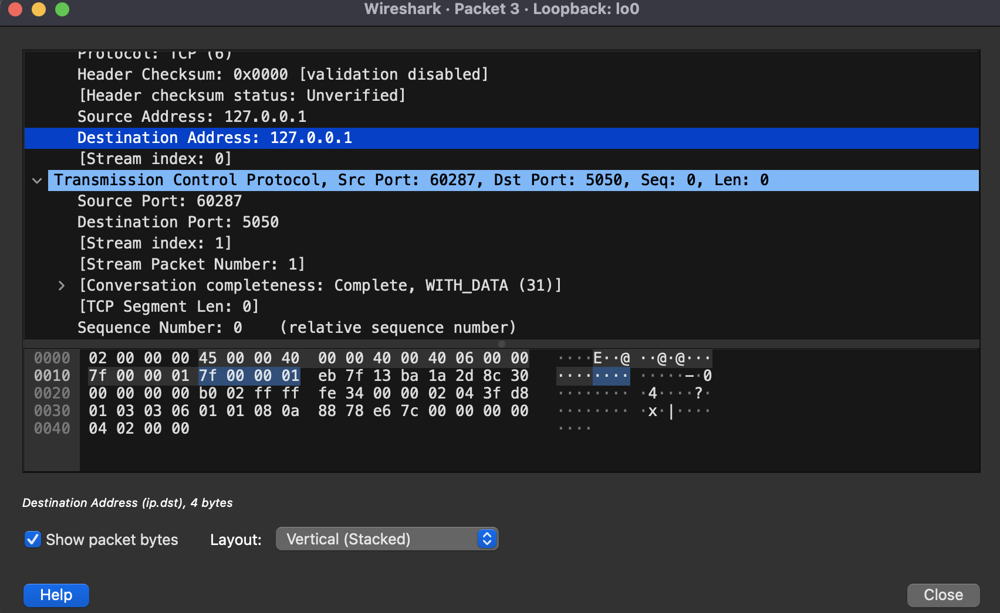
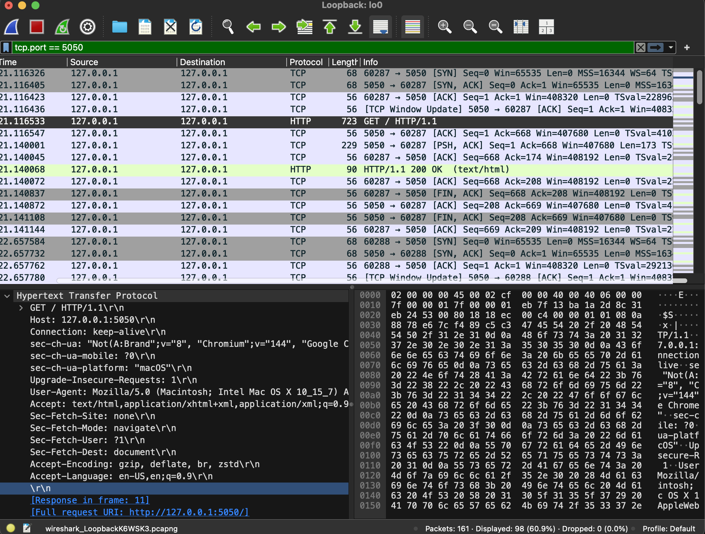
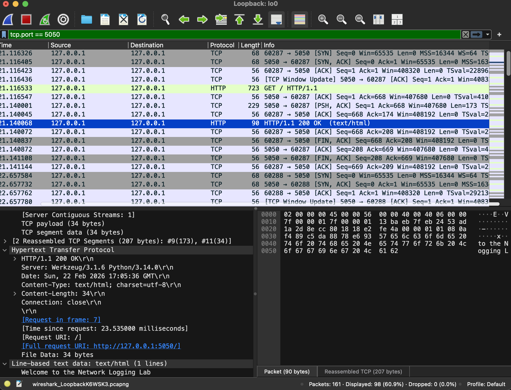
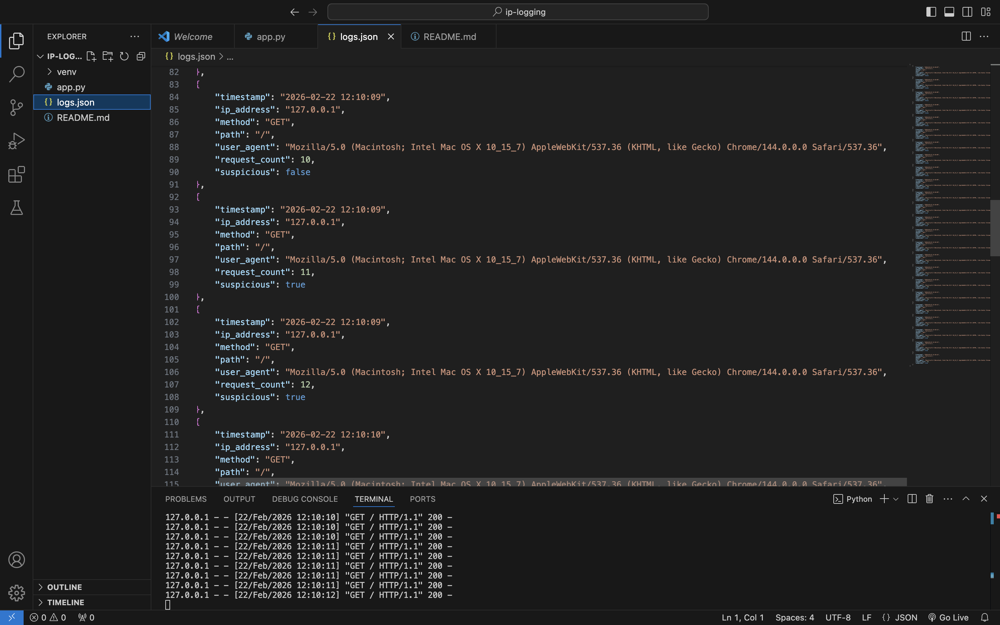

# Network Logging Lab (Flask + Wireshark)

## Project Overview
This project demonstrates logging HTTP requests to logs.json, tracking request counts, and flagging suspicious behavior. Network traffic is captured using Wireshark to show TCP handshake, HTTP GET, and responses.

## Tools Used
- Python 3 (venv)
- Flask
- Wireshark
- JSON for logging

## Setup Instructions
1. Clone repo
2. Create venv and activate: `python3 -m venv venv && source venv/bin/activate`
3. Install Flask: `python -m pip install flask`
4. Run server: `python app.py`
5. Open browser: `http://127.0.0.1:5050/`
6. Refresh 11+ times to trigger suspicious detection.

## How It Works
1. TCP Handshake: client connects to server  
2. HTTP GET Request: request logged in logs.json  
3. HTTP Response: server reply  
4. Suspicious Detection: >10 requests flagged as suspicious

## Screenshots
  
## TCP Handshake: Shows the initial three-way handshake between client and server (SYN → SYN/ACK → ACK) to establish a connection before any data is exchanged.

  
## HTTP GET Request: The browser requests the home page (`/`). This request is captured by Wireshark and logged by the Flask server.

  
## HTTP Response: The Flask server responds to the GET request with a simple welcome message, which is captured by Wireshark.

## Suspicious Detection: The server flags this IP as suspicious after more than 10 requests. The `logs.json` file records timestamp, IP, request method, path, user agent, and suspicious status.
